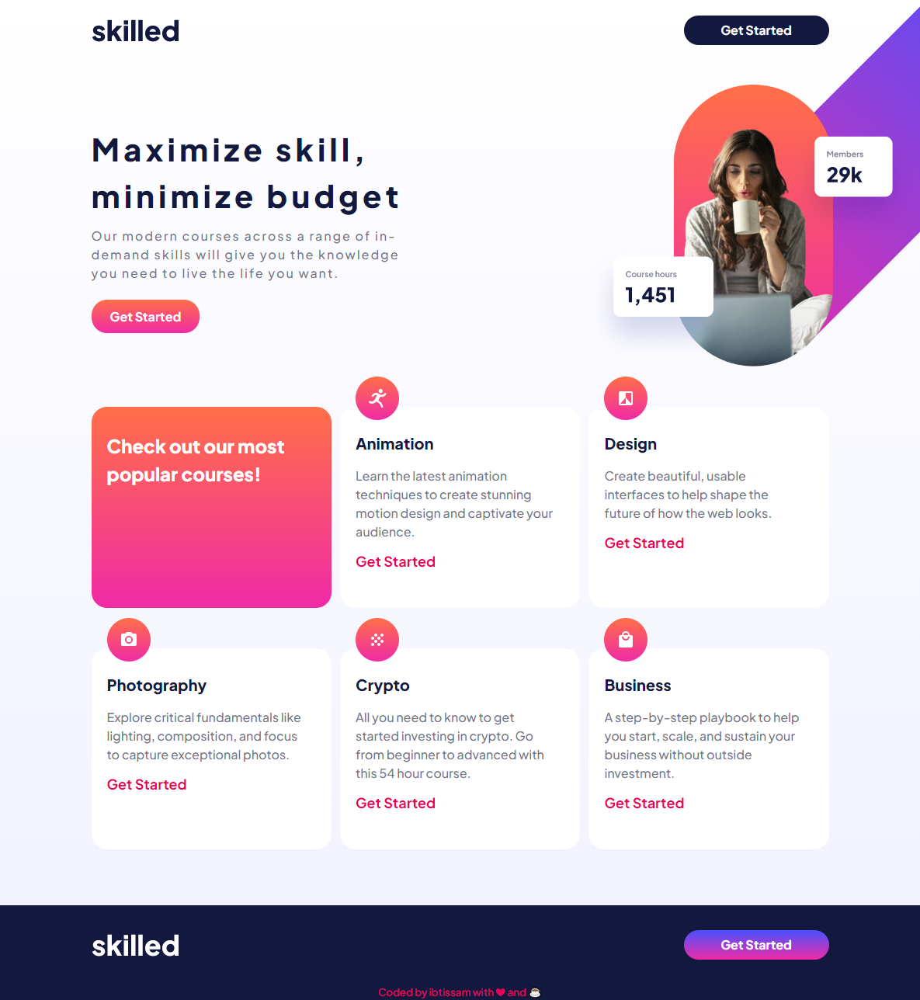

# Frontend Mentor - Skilled e-learning landing page
 this is a solution to the <a href="https://www.frontendmentor.io/challenges/skilled-elearning-landing-page-S1ObDrZ8q" >Skilled e-learning landing page challenge on Frontend Mentor.</a>

## Built with 

- HTML & SCCS
- GulpJS
- Mobile-first Workflow

## Link

To see Live [Click Here](https://luminous-babka-535d16.netlify.app/)

## My Process

My main goal in this Project was to Build out a Micro design system, to make my website flexible and easy to maintain based on a given design system.
I've tried to Build out a simple Design system by combining CSS variables, SCSS and adopting BEM Methodology to write CSS classes.

## Preview

